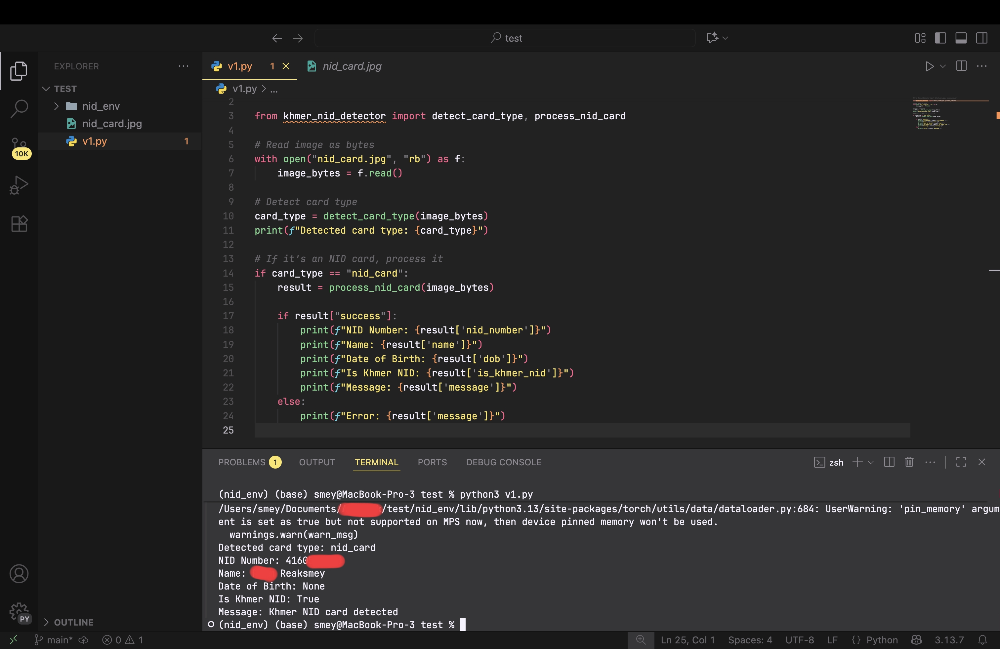

# Khmer NID Detector 🇰🇭



A powerful Python package for **detecting and extracting information from Khmer National ID cards** using advanced OCR and Computer Vision. Effortlessly automate document recognition and data extraction for Cambodian IDs!

## 🌐 PyPI Project Page

Find the package and more details on [PyPI](https://pypi.org/project/khmer-nid-detector/)


---

## 📦 Installation

Get started instantly from PyPI:

```bash
pip install khmer-nid-detector
```

---

## 🚀 Features

- 🔍 **Smart Card Type Detection** – Instantly recognizes the type of card or document.
- 🇰🇭 **Khmer NID Focused** – Tailored for Cambodian National ID cards.
- 📄 **Rich Information Extraction** – Pulls NID number, name, and date of birth.
- 🖼️ **Image Preprocessing** – Boosts image clarity for accurate OCR.
- ⚡ **Lightweight & User-Friendly** – Minimal dependencies, simple API.
- 🧠 **Intelligent Parsing** – Uses regex and heuristics for robust data extraction.

---

## 🪪 Supported Card Types

| Type           | Description                    |
|----------------|-------------------------------|
| nid_card       | Khmer National ID card         |
| credit_card    | Credit card                    |
| debit_card     | Debit card                     |
| driver_license | Driver’s license               |
| business_card  | Business card                  |
| other_document | Other document types           |
| not_a_card     | Not a card or unsupported doc  |

---

## 💡 Example Usage

```python
from khmer_nid_detector import detect_card_type, process_nid_card

# Load image as bytes
with open("nid_card.jpg", "rb") as f:
    image_bytes = f.read()

# Detect card type
card_type = detect_card_type(image_bytes)
print(f"Detected card type: {card_type}")

# Process NID card if detected
if card_type == "nid_card":
    result = process_nid_card(image_bytes)
    if result["success"]:
        print(f"NID Number: {result['nid_number']}")
        print(f"Name: {result['name']}")
        print(f"Date of Birth: {result['dob']}")
        print(f"Is Khmer NID: {result['is_khmer_nid']}")
        print(f"Message: {result['message']}")
    else:
        print(f"Error: {result['message']}")
```

---

## 📁 Example Project Structure

```
.
├── IMG_20251005_154748.png
├── nid_card.jpg
├── nid_env
│   ├── bin
│   ├── include
│   ├── lib
│   ├── pyvenv.cfg
│   └── share
└── v1.py
```

---

## ▶️ Run Example Code

```bash
python3 v1.py
```

---

## ⚙️ Requirements

- Python 3.8+
- opencv-python
- pytesseract
- Pillow
- numpy

Install dependencies manually if needed:

```bash
pip install -r requirements.txt
```

---

## 🧠 How It Works

1. **Preprocessing:** Cleans and enhances the input image.
2. **Card Type Detection:** Classifies the image into supported types.
3. **Text Extraction (OCR):** Extracts Khmer and English text.
4. **Information Parsing:** Detects NID number, name, and date of birth.

---

## 🧑‍💻 Author

**Roem Reaksmey**  
💼 AI Developer / Computer Vision Researcher  
📧 roemreaksmey7@gmail.com  

---

## 📄 License

Licensed under the MIT License – see the LICENSE file for details.

---

## ❤️ Acknowledgments

- OpenCV & Tesseract OCR for image processing
- Khmer OCR research community
- Contributors supporting Khmer AI development

---

## ✨ Example Output

```yaml
Detected card type: nid_card
NID Number: 012345678
Name: Sok Dara
Date of Birth: 1998-03-25
Is Khmer NID: True
Message: Khmer NID detected successfully
```
